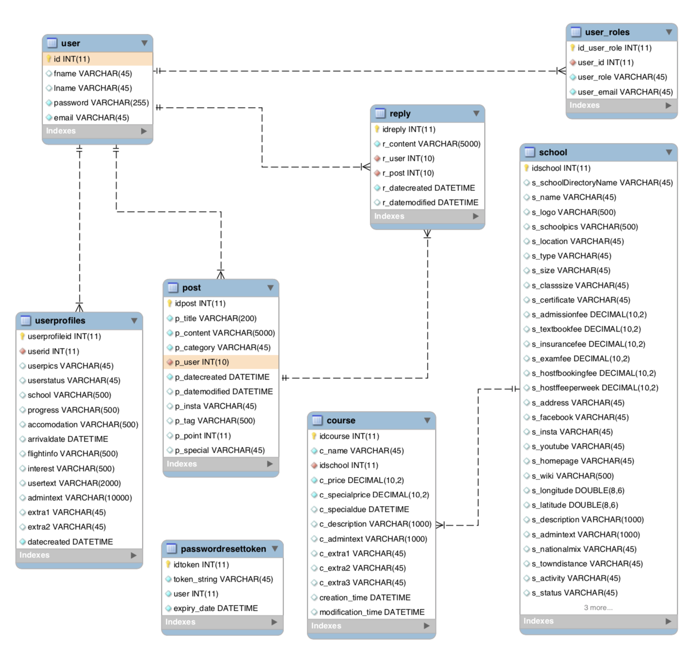

## Java Spring MVC Framework - CRM Software Web application Project

This project was built to demonstrate how Java Spring-framework and Hibernate can be used in a real-world situation.
Java spring framework has almost every functionality web application required from user-login handling to ORM(Object Relation Management) for a database. Through this project, I would like to show how each Spring module can be used for the purpose respectively.
```
©Jin Lim
```
[Proto type on live server](https://liffeyireland.com) - Korean


## Database Design and Entity Relations

```
MySQL database used
```
## Built With

* [Spring](https://spring.io/) - The web framework used
* [SpringSecurity](https://spring.io/projects/spring-security/) - User Login and User Authorizing
* [Maven](https://maven.apache.org/) - Dependency Management
* [Hibernate](http://hibernate.org/) - Used to ORM mapping and Entity Validation
* [MySQL](https://www.mysql.com/) - Relational Database Used
* [Tomcat](http://tomcat.apache.org/) - Open Source web server and servlet container

## Demo


## License

This project is licensed under the MIT License.
